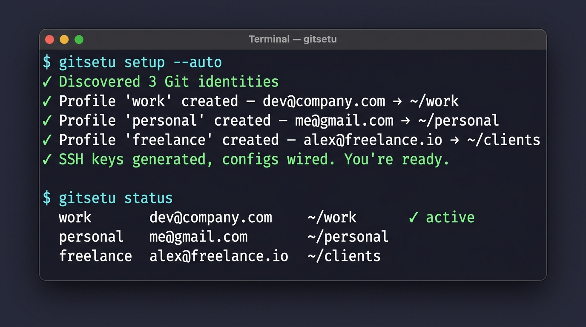

<div align="center">


# GitSetu

**One command. All identities. Every machine.**

*Stop pushing freelance commits with your corporate email.*

[](https://github.com/bhaskarjha-dev/gitsetu/actions/workflows/ci.yml)
[](LICENSE)
[](https://www.gnu.org/software/bash/)
[](#testing)
[](#cross-platform)
[](https://gitsetu.bhaskarjha.dev)

<br/>



<br/>

[Getting Started](#getting-started) · [How It Works](#how-it-works) · [Features](#features) · [Installation](#installation) · [Documentation](#documentation)

</div>

<br/>

## The Problem

You have a work GitHub, a personal GitHub, maybe a freelance GitLab. Every day you juggle SSH keys, `.gitconfig` conditionals, and credential helpers — and one mistake means a commit with the wrong email that lives in history forever.

Existing solutions require Go binaries, YAML configs, or manual `includeIf` wrangling. They solve half the problem and break on Windows.

## The Fix

```bash
gitsetu setup --auto
```

GitSetu scans your machine, discovers your existing Git identities, and **in one command** generates SSH keys, wires `includeIf` routing, configures credential helpers, and provisions workspace directories. Then it exits. No daemon. No background process. Git and OpenSSH handle everything natively from that point forward.

**Zero dependencies. Pure Bash 3.2. Works everywhere Git does.**

---

## Getting Started

### 30-Second Quick Start

```bash
# Install
curl -fsSL https://raw.githubusercontent.com/bhaskarjha-dev/gitsetu/main/install.sh | bash

# Setup (discovers identities automatically)
gitsetu setup --auto

# Verify everything works
gitsetu status
```

That's it. Every repo you clone under `~/work` now uses your work identity. Every repo under `~/personal` uses your personal identity. Automatically.

### What Just Happened?

GitSetu compiled native configuration into three places and exited:

```
~/.gitconfig          ← includeIf rules route identity by directory
~/.ssh/config         ← Include directive sandboxes SSH host aliases
~/.config/gitsetu/    ← Profile configs, SSH keys, credential tokens
```

There is no daemon. There is no runtime. Git and OpenSSH evaluate these rules natively on every operation.

> [!NOTE]
> **Non-Destructive & Safe:** GitSetu writes strictly between `# [gitsetu:managed:start]` and `# [gitsetu:managed:end]` markers. Existing manual `includeIf` rules, custom aliases, and `~/.ssh/config` host blocks are 100% preserved. `setup --auto` automatically discovers existing manual identities and workspace paths.

---

## How It Works

```
┌─────────────────────────────────────────────────────────┐
│  $ cd ~/work && git commit                              │
│                                                         │
│  Git reads ~/.gitconfig                                 │
│    → includeIf "gitdir:~/work/" matches                 │
│    → loads ~/.config/gitsetu/profiles/work.gitconfig     │
│    → user.name = "Dev Name"                             │
│    → user.email = "dev@company.com"                     │
│    → core.sshCommand = ssh -i ~/.ssh/id_ed25519_work    │
│                                                         │
│  ✓ Correct identity. Correct SSH key. Zero intervention.│
└─────────────────────────────────────────────────────────┘
```

GitSetu is a **configuration compiler**, not a runtime tool. It generates the rules once, then Git's own `includeIf` engine handles directory-scoped identity switching on every `clone`, `commit`, `push`, and `fetch` — natively, at zero latency.

---

## Features

### Core

| Feature | Description |
|---------|-------------|
| **Auto-Discovery** | `setup --auto` scans your machine for existing Git identities and SSH keys |
| **Directory Routing** | `includeIf` rules auto-switch identity when you `cd` into a project |
| **SSH Key Generation** | Ed25519 keypairs per profile, with FIDO2/YubiKey support |
| **Credential Broker** | Per-profile HTTPS PAT routing via macOS Keychain, Linux secret-tool, or Windows Credential Manager |
| **Pre-Commit Guard** | Blocks commits if `user.email` doesn't match the expected profile for the directory |
| **Encrypted Backup** | `gitsetu backup` exports everything (keys, configs, tokens) as an AES-256 encrypted archive |

### Developer Experience

| Feature | Description |
|---------|-------------|
| **Context Runner** | `gitsetu run work -- git push` executes commands under a specific identity |
| **Shell Prompt** | `gitsetu prompt` returns the active profile name for `$PS1` / Starship integration (< 2ms) |
| **Doctor** | `gitsetu doctor` runs diagnostic checks on your entire identity infrastructure |
| **Verify** | `gitsetu verify` tests SSH connectivity and gitconfig integrity |
| **Completions** | Tab completions for Bash and Zsh with dynamic profile suggestions |

### Cross-Platform

| | Linux | macOS | Windows |
|--|:-----:|:-----:|:-------:|
| **Shell Support** | Bash, Zsh | Bash, Zsh | Git Bash, PowerShell, CMD, VS Code |
| **SSH Keys** | ✓ | ✓ | ✓ (NTFS-aware permissions) |
| **Credential Store** | secret-tool | Keychain | Credential Manager |
| **CRLF Handling** | — | — | 4-tier self-healing cascade |
| **Installer** | `install.sh` / Homebrew / AUR / Nix | `install.sh` / Homebrew | `install.ps1` / WinGet / Scoop |

---

## Installation

### npm (All Platforms)

```bash
npm install -g gitsetu
```

### Linux & macOS

```bash
# One-line installer
curl -fsSL https://raw.githubusercontent.com/bhaskarjha-dev/gitsetu/main/install.sh | bash
```

**Package managers:**

```bash
# Homebrew
brew tap bhaskarjha-dev/tap && brew install gitsetu

# Arch Linux (AUR)
yay -S gitsetu

# Nix
nix run github:bhaskarjha-dev/gitsetu
```

### Windows

> **Prerequisite:** [Git for Windows](https://git-scm.com/download/win) (`winget install Git.Git`).

```powershell
# PowerShell one-liner
irm https://raw.githubusercontent.com/bhaskarjha-dev/gitsetu/main/install.ps1 | iex
```

**Package managers:**

```powershell
# WinGet (Official Microsoft Package Identifier)
winget install BhaskarJha.GitSetu
# Or once indexed locally:
winget install GitSetu

# Scoop
scoop bucket add gitsetu https://github.com/bhaskarjha-dev/scoop-gitsetu
scoop install gitsetu
```

### GitHub CLI Extension

```bash
gh extension install bhaskarjha-dev/gh-gitsetu
gh gitsetu setup --auto
```

> [!NOTE]
> On Windows, once configured, automatic identity switching works natively everywhere — PowerShell, CMD, Windows Terminal, VS Code, and JetBrains IDEs. No shell hook required.

---

## Usage

### Interactive Setup

```bash
gitsetu setup
```

Walks you through creating profiles one at a time. Generates SSH keys, creates `includeIf` rules, provisions directories.

### Zero-Prompt Setup

```bash
gitsetu setup --auto
```

Scans your machine for existing Git identities and sets everything up without prompts.

### Add a Profile Non-Interactively

```bash
gitsetu add work "Your Name" dev@company.com ~/work
```

### Day-to-Day Commands

```bash
# See all profiles and which is active
gitsetu status

# Verify SSH keys and config integrity
gitsetu verify

# Run diagnostic checks
gitsetu doctor

# Run a command as a specific profile
gitsetu run work -- git push origin main

# Install pre-commit identity guard
gitsetu guard --install

# Backup everything (encrypted)
gitsetu backup

# Restore on a new machine
gitsetu restore backup.tar.gz.enc

# Clean removal of all GitSetu configs
gitsetu teardown
```

---

## Why GitSetu?

| | GitSetu | gitego | karn | gitch | Manual DIY |
|---|:---:|:---:|:---:|:---:|:---:|
| Zero dependencies | ✓ | | | | ✓ |
| Auto-discovery setup | ✓ | | | | |
| SSH key generation | ✓ | ~ | ~ | ~ | |
| Pre-commit guard | ✓ | ~ | ✓ | ✓ | |
| Credential broker | ✓ | ✓ | ~ | ✓ | |
| Encrypted backup | ✓ | | | | |
| Windows native support | ✓ | ~ | | | ~ |
| Built-in doctor/verify | ✓ | | | | |
| Shell prompt (< 2ms) | ✓ | ✓ | ✓ | ✓ | |

See [full comparison →](docs/overview/comparisons.md)

---

## Documentation

> **📘 [gitsetu.bhaskarjha.dev →](https://gitsetu.bhaskarjha.dev)**

| Guide | Description |
|-------|-------------|
| [Quickstart](docs/getting-started/quickstart.md) | 4-step setup guide |
| [Installation](docs/getting-started/installation.md) | All installation methods |
| [CLI Reference](docs/reference/cli-commands.md) | Every command, flag, and option |
| [Architecture](docs/overview/architecture.md) | How the configuration compiler works |
| [Identity Routing](docs/core-engines/identity-routing.md) | Deep dive into `includeIf` engine |
| [SSH Orchestrator](docs/core-engines/ssh-orchestrator.md) | Key generation and host alias routing |
| [Credential Broker](docs/core-engines/credential-broker.md) | HTTPS PAT and keychain integration |
| [Pre-Commit Guard](docs/core-engines/precommit-guard.md) | Fail-closed identity verification |
| [Hardware Keys](docs/guides/hardware-keys.md) | FIDO2 / YubiKey setup |
| [Vault Backups](docs/guides/vault-backups.md) | Encrypted export/import |
| [Shell Prompt](docs/guides/shell-prompt.md) | PS1 / Starship integration |
| [WSL Integration](docs/guides/wsl-integration.md) | Windows Subsystem for Linux |
| [Security & Privacy](docs/enterprise/security-privacy.md) | Threat model and security posture |
| [Troubleshooting](docs/reference/troubleshooting.md) | Common issues and fixes |
| [FAQ](docs/reference/faq.md) | Frequently asked questions |

---

## Testing

GitSetu is tested with **36 automated test suites** (including clean-room npm E2E and adversarial stress suites) and a **31-phase empirical sandbox audit** (107 checks) that runs inside an isolated Windows Sandbox VM.

```bash
# Run unit & E2E tests
bash tests/run_all.sh

# Run comprehensive audit (auto-creates isolation)
bash sandbox/comprehensive_audit.sh sandbox/results
```

```powershell
# Launch Windows Sandbox (disposable isolated VM)
powershell -ExecutionPolicy Bypass -File sandbox\launch_sandbox.ps1

# Or via Command Prompt:
sandbox\launch_sandbox.bat
```

See [sandbox/README.md](sandbox/README.md) for details.

---

## Contributing

Contributions are welcome! Please read [CONTRIBUTING.md](CONTRIBUTING.md) before submitting a PR.

```bash
# Fork & clone
git clone https://github.com/YOUR_USERNAME/gitsetu.git
cd gitsetu

# Run tests
bash tests/run_all.sh

# Check shell quality
shellcheck gitsetu lib/*.sh
```

See also: [Code of Conduct](CODE_OF_CONDUCT.md) · [Security Policy](SECURITY.md)

---

## License

MIT — see [LICENSE](LICENSE).

<div align="center">

**[Website](https://gitsetu.bhaskarjha.dev)** · **[Documentation](docs/getting-started/quickstart.md)** · **[Changelog](CHANGELOG.md)** · **[Report a Bug](https://github.com/bhaskarjha-dev/gitsetu/issues/new?template=bug_report.yml)**

</div>
