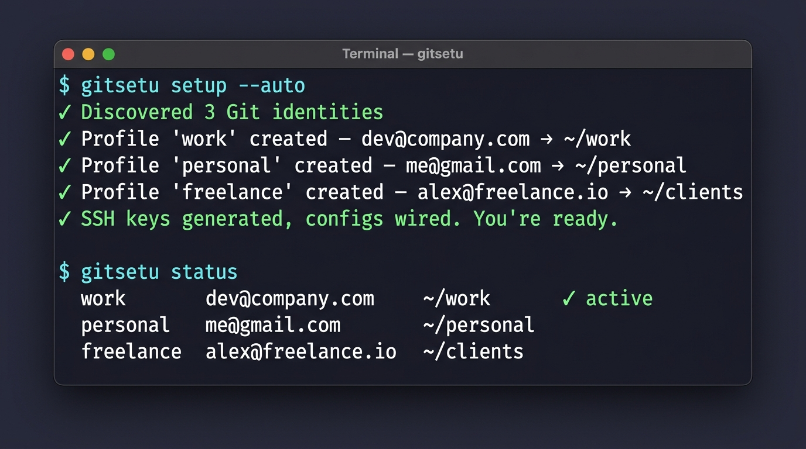

<div align="center">


# GitSetu

**One command. All identities. Every machine.**

*Stop pushing freelance commits with your corporate email.*

[](https://github.com/bhaskarjha-dev/gitsetu/actions/workflows/ci.yml)
[](LICENSE)
[](https://www.gnu.org/software/bash/)
[](#testing)
[](#cross-platform)
[](https://gitsetu.bhaskarjha.dev)

<br/>



<br/>

[Getting Started](#getting-started) · [How It Works](#how-it-works) · [Features](#features) · [Installation](#installation) · [Documentation](#documentation)

</div>

<br/>

## The Problem

You have a work GitHub, a personal GitHub, maybe a freelance GitLab. Every day you juggle SSH keys, `.gitconfig` conditionals, and credential helpers — and one mistake means a commit with the wrong email that lives in history forever.

Existing solutions require Go binaries, YAML configs, or manual `includeIf` wrangling. They solve half the problem and break on Windows.

## The Fix

```bash
gitsetu setup --auto
```

GitSetu scans your machine, discovers your existing Git identities, and **in one command** generates SSH keys, wires `includeIf` routing, configures credential helpers, and provisions workspace directories. Then it exits. No daemon. No background process. Git and OpenSSH handle everything natively from that point forward.

**Pure Bash 3.2 core. Native Git and OpenSSH integration. Optional platform stores and OpenSSL are detected explicitly.**

> **Release state:** v1.1.0 is a verified, publication-ready release candidate. The canonical release workflow has not yet published package-manager assets, a signed release, or an immutable `v1.1.0` download. Use a reviewed local checkout and verify its provenance; see [Installation](#installation) and [Security Policy](SECURITY.md).

---

## Getting Started

### Quick Start

```bash
# For the current publication-ready candidate, run from a reviewed checkout:
bash install.sh

# Setup (discovers identities automatically)
gitsetu setup --auto

# Verify the managed configuration
gitsetu status
```

### What Just Happened?

GitSetu compiled native configuration into three places and exited:

```
~/.gitconfig          ← includeIf rules route identity by directory
~/.ssh/config         ← Include directive sandboxes SSH host aliases
~/.config/gitsetu/    ← Versioned profile registry and managed configs/keys
```

There is no daemon. There is no runtime. Git and OpenSSH evaluate these rules natively on every operation.

> [!NOTE]
> **Managed-file safety:** GitSetu writes only its own generated profile files and marked configuration blocks. Existing manual `includeIf` rules, aliases, and unrelated `~/.ssh/config` host blocks are left outside those blocks. `setup --auto` can discover existing identities; review the proposed changes before applying them.

---

## How It Works

```
┌─────────────────────────────────────────────────────────┐
│  $ cd ~/work && git commit                              │
│                                                         │
│  Git reads ~/.gitconfig                                 │
│    → includeIf "gitdir:~/work/" matches                 │
│    → loads ~/.config/gitsetu/profiles/work.gitconfig     │
│    → user.name = "Dev Name"                             │
│    → user.email = "dev@company.com"                     │
│    → core.sshCommand = ssh -i ~/.ssh/id_ed25519_work    │
│                                                         │
│  ✓ Correct identity. Correct SSH key. Zero intervention.│
└─────────────────────────────────────────────────────────┘
```

GitSetu is a **configuration compiler**, not a daemon. It generates rules once; Git and OpenSSH evaluate them on each operation, subject to their own configuration semantics and performance.

---

## Features

### Core

| Feature | Description |
|---------|-------------|
| **Auto-Discovery** | `setup --auto` scans your machine for existing Git identities and SSH keys |
| **Directory Routing** | `includeIf` rules auto-switch identity when you `cd` into a project |
| **SSH Key Generation** | Ed25519 keypairs per profile, with FIDO2/YubiKey support |
| **Credential Broker** | Per-profile HTTPS PAT routing via native OS stores; an explicitly selected zero-dependency plaintext fallback is warned about |
| **Pre-Commit Guard** | Blocks commits in managed repositories when the effective identity is unresolved or divergent; unmanaged repositories fail open |
| **Authenticated Backup** | `gitsetu backup` exports managed keys and configuration in an authenticated v2 vault; old vault formats are rejected |

### Developer Experience

| Feature | Description |
|---------|-------------|
| **Context Runner** | `gitsetu run work -- git push` executes commands under a specific identity |
| **Shell Prompt** | `gitsetu prompt` returns the active profile label for `$PS1` / Starship integration |
| **Doctor** | `gitsetu doctor` runs diagnostic checks on your entire identity infrastructure |
| **Verify** | `gitsetu verify` tests SSH connectivity and gitconfig integrity |
| **Completions** | Tab completions for Bash and Zsh with dynamic profile suggestions |

### Cross-Platform

| | Linux | macOS | Windows |
|--|:-----:|:-----:|:-------:|
| **Shell Support** | Bash, Zsh | Bash, Zsh | Git Bash, PowerShell, CMD, VS Code |
| **SSH Keys** | ✓ | ✓ | ✓ (NTFS-aware permissions) |
| **Credential Store** | secret-tool | Keychain | Credential Manager |
| **CRLF Handling** | — | — | 4-tier self-healing cascade |
| **Installer** | `install.sh` (local release-candidate checkout) | `install.sh` (local release-candidate checkout) | `install.ps1` (local release-candidate checkout) |

---

## Installation

### npm (All Platforms)

The npm package is a private release candidate; there is no public registry
installation yet. Use the reviewed checkout installer instead:

```bash
bash install.sh
```

### Linux & macOS

For a local release-candidate checkout, run the reviewed installer from the checkout:

```bash
bash install.sh
```

For a public release, use the release documentation and package manager for your platform. Do not pipe a mutable `main` URL into a shell; verify the release tag and checksum/signature first.

**Package managers:**

No public Homebrew, AUR, or Nix package is published for the release candidate.
The repository contains withheld templates for a future intentional release;
do not install them from this checkout.

### Windows

> **Prerequisite:** [Git for Windows](https://git-scm.com/download/win) (`winget install Git.Git`).

Run `install.ps1` from a reviewed, pinned checkout. For a public release, prefer the published package-manager manifest and verify its hash/signature before installation.

**Package managers:**

No public WinGet or Scoop package is published for the release candidate.
The repository contains withheld templates for a future intentional release;
use `install.ps1` from a reviewed checkout for now.

### GitHub CLI Extension

The `gh-gitsetu` and `gh-setu` extension repositories are not published as
public releases yet. From a reviewed checkout, the wrappers can be exercised
directly:

```bash
bash packaging/gh-extension/gh-gitsetu --version
bash packaging/gh-extension/gh-setu --version
```

> [!NOTE]
> On Windows, once configured, automatic identity switching works natively everywhere — PowerShell, CMD, Windows Terminal, VS Code, and JetBrains IDEs. No shell hook required.

---

## Usage

### Interactive Setup

```bash
gitsetu setup
```

Walks you through creating profiles one at a time. Generates SSH keys, creates `includeIf` rules, provisions directories.

### Zero-Prompt Setup

```bash
gitsetu setup --auto
```

Scans your machine for existing Git identities and sets everything up without prompts.

### Add a Profile Non-Interactively

```bash
gitsetu add work "Your Name" dev@company.com ~/work
```

### Day-to-Day Commands

```bash
# See all profiles and which is active
gitsetu status

# Verify SSH keys and config integrity
gitsetu verify

# Run diagnostic checks
gitsetu doctor

# Run a command as a specific profile
gitsetu run work -- git push origin main

# Install pre-commit identity guard
gitsetu guard --install

# Create an authenticated v2 vault
gitsetu backup

# Restore on a new machine (v2 vaults only)
gitsetu restore /path/to/gitsetu_vault_YYYYMMDD_HHMMSS.tar.gz.enc

# Clean removal of all GitSetu configs
gitsetu teardown
```

---

## Why GitSetu?

| | GitSetu | gitego | karn | gitch | Manual DIY |
|---|:---:|:---:|:---:|:---:|:---:|
| Zero runtime dependencies | ✓ | | | | ✓ |
| Auto-discovery setup | ✓ | | | | |
| SSH key generation | ✓ | ~ | ~ | ~ | |
| Pre-commit guard | ✓ | ~ | ✓ | ✓ | |
| Credential broker | ✓ | ✓ | ~ | ✓ | |
| Authenticated v2 backup | ✓ | | | | |
| Windows native support | ✓ | ~ | | | ~ |
| Built-in doctor/verify | ✓ | | | | |
| Shell prompt | ✓ | ✓ | ✓ | ✓ | |

See [full comparison →](docs/overview/comparisons.md)

---

## Documentation

> **📘 [gitsetu.bhaskarjha.dev →](https://gitsetu.bhaskarjha.dev)**

| Guide | Description |
|-------|-------------|
| [Quickstart](docs/getting-started/quickstart.md) | 4-step setup guide |
| [Installation](docs/getting-started/installation.md) | All installation methods |
| [CLI Reference](docs/reference/cli-commands.md) | Every command, flag, and option |
| [Architecture](docs/overview/architecture.md) | How the configuration compiler works |
| [Identity Routing](docs/core-engines/identity-routing.md) | Deep dive into `includeIf` engine |
| [SSH Orchestrator](docs/core-engines/ssh-orchestrator.md) | Key generation and host alias routing |
| [Credential Broker](docs/core-engines/credential-broker.md) | HTTPS PAT and keychain integration |
| [Pre-Commit Guard](docs/core-engines/precommit-guard.md) | Fail-closed identity verification |
| [Hardware Keys](docs/guides/hardware-keys.md) | FIDO2 / YubiKey setup |
| [Vault Backups](docs/guides/vault-backups.md) | Encrypted export/import |
| [Shell Prompt](docs/guides/shell-prompt.md) | PS1 / Starship integration |
| [WSL Integration](docs/guides/wsl-integration.md) | Windows Subsystem for Linux |
| [Security & Privacy](docs/enterprise/security-privacy.md) | Threat model and security posture |
| [Troubleshooting](docs/reference/troubleshooting.md) | Common issues and fixes |
| [FAQ](docs/reference/faq.md) | Frequently asked questions |

---

## Testing

GitSetu has automated unit, integration, tamper, concurrency, packaging, and platform tests. Run the complete local suite with `bash tests/run_all.sh`; the Windows Sandbox audit is an additional isolated environment and is not a substitute for the regression suite.

```bash
# Run unit & E2E tests
bash tests/run_all.sh

# Run comprehensive audit (auto-creates isolation)
bash sandbox/comprehensive_audit.sh sandbox/results
```

```powershell
# Launch Windows Sandbox (disposable isolated VM)
powershell -ExecutionPolicy Bypass -File sandbox\launch_sandbox.ps1

# Or via Command Prompt:
sandbox\launch_sandbox.bat
```

See [sandbox/README.md](sandbox/README.md) for details.

---

## Contributing

Contributions are welcome! Please read [CONTRIBUTING.md](CONTRIBUTING.md) before submitting a PR.

```bash
# Fork & clone
git clone https://github.com/YOUR_USERNAME/gitsetu.git
cd gitsetu

# Run tests
bash tests/run_all.sh

# Check shell quality
shellcheck gitsetu lib/*.sh
```

See also: [Code of Conduct](CODE_OF_CONDUCT.md) · [Security Policy](SECURITY.md)

---

## License

MIT — see [LICENSE](LICENSE).

<div align="center">

**[Website](https://gitsetu.bhaskarjha.dev)** · **[Documentation](docs/getting-started/quickstart.md)** · **[Changelog](CHANGELOG.md)** · **[Report a Bug](https://github.com/bhaskarjha-dev/gitsetu/issues/new?template=bug_report.yml)**

</div>
